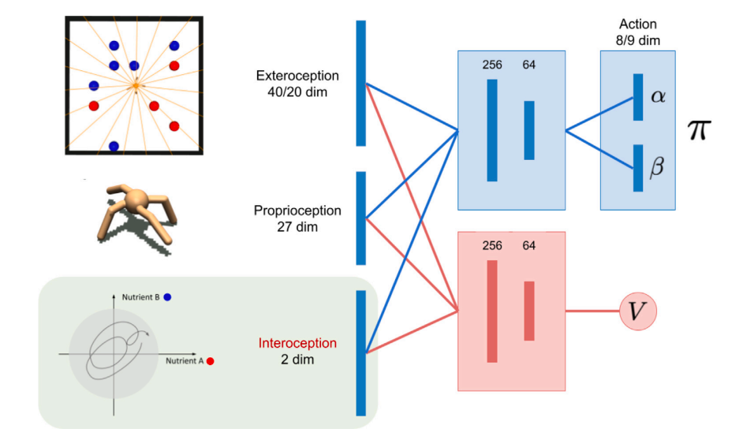

# Notes on Network Characterization

## What are the input to the network?
The network has three inputs along with the following dimensions:
- Exteroception (or the input of external state): 40 dim
- Proprioception (or the input of body's movement or position in space): 27 dim
- Interoception (or the input of the internal state of the body): 2 dim



## What are the outputs?
Outputs for the two networks are as follows
- Actor: Torque values of the joints of the robot; Dim = 8
- Critic: Value function

## What is the action space?
Torque values of the joints of the robot; Dim = 8

## What is the state space?
Embedded image/sensor observation from exteroception concatenated with proprioception and interoception
- dim without image: 40+27+2 = 69
  - Extroception (40 dim) : 20 dim for each of the two depth sensors measuring the distance to the nearest resource(red/blue) in 20 directions. Which means 20 dims for blue and 20 dims for red resource respectively.

  - Proprioception (27 dim) : 27 dims consisting of the position and velocity of the joints of the robot.
  
  - Interoception (2 dim) : 2 dims (Red and Blue resource) consisting of the internal state of the robot. 
- dim with image: 200+27+2 = 229

## Brief documentation of the architecture of the network?

```
Agent(
  (critic): Sequential(
    (0): Linear(in_features=69, out_features=256, bias=True)
    (1): Tanh()
    (2): Linear(in_features=256, out_features=256, bias=True)
    (3): Tanh()
    (4): Linear(in_features=256, out_features=1, bias=True)
  )
  (actor): Sequential(
    (0): Linear(in_features=69, out_features=256, bias=True)
    (1): Tanh()
    (2): Linear(in_features=256, out_features=256, bias=True)
    (3): Tanh()
    (4): BetaHead(
      (fcc_c0): Linear(in_features=256, out_features=8, bias=True)
      (fcc_c1): Linear(in_features=256, out_features=8, bias=True)
    )
  )
)
```